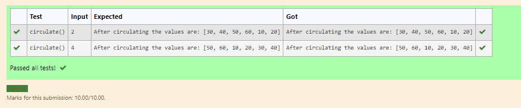

# Circulate-the-values-of-N-variables
## Aim:
To write a python program to circulate the n variables using function concept
## Equipment’s required:
PC
Anaconda - Python 3.7
## Algorithm: 
### Step 1: 
Get the two values from the user

### Step 2: 
Assign the value of x variable
### Step 3: 
Get the value from the user for the number of rotation
### Step 4: 
Using the slicing concept rotate the list

### Step 5: 
Print the values it would be circulated
### Step 6:
End the program 
## Program:
~~~
#Program to circulate N values.
#Developed by: Dharani. E
#RegisterNumber:
def circulate():
    x=[10,20,30,40,50,60]
    a=int(input())
    output=x[a:]+x[:a]
    
    print ("After circulating the values are:",output) 
~~~

## Output:

## Result:
Thus the circulate the values of N variables.
